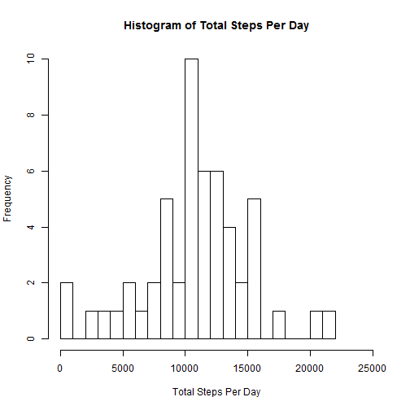
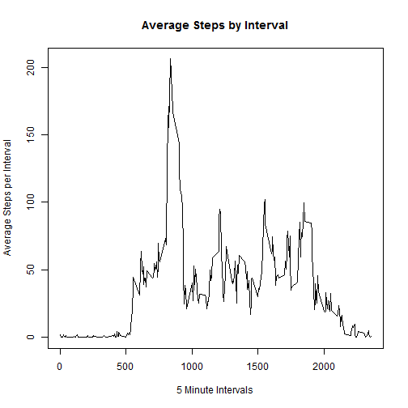
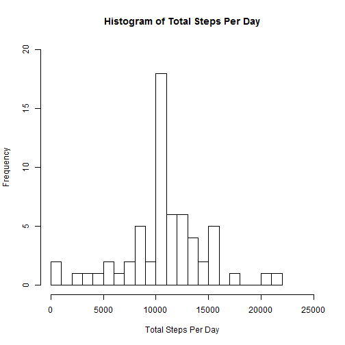
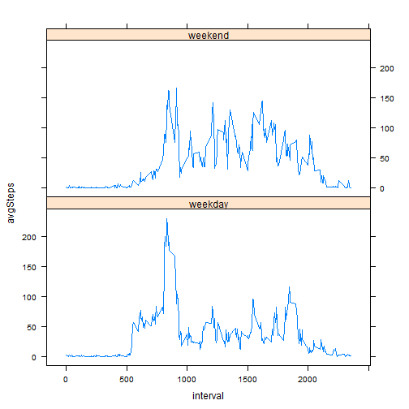

## Peer Assessment 1

Set directory to work directory.

Download zip file, unzip and save.

```r
fileURL <- "http://d396qusza40orc.cloudfront.net/repdata%2Fdata%2Factivity.zip"
temp<-tempfile()
download.file(fileURL,temp,mode="wb")
unzip(temp,exdir=".")
unlink(temp)
```

Document date and time of download in "dateDownloaded"

```r
dateDownloaded<-Sys.time()
```
The data file was downloaded at 2015-02-12 22:04:00.

Read the file into a data frame, act, then subset without NA's to act1.

```r
act<-read.csv("./activity.csv")
index<-which(!is.na(act$steps))
act1<-act[index,]
```

Aggregate by date to compute sum of steps taken each day.

```r
agts<-aggregate(act1$steps, by=list(date=act1$date),FUN=sum,na.rm=TRUE)
names(agts)<-c("date","steps")
```

Plot histogram showing frequency of total steps per day.

```r
hist(agts$steps,breaks=20,main="Histogram of Total Steps Per Day",xlim=c(0,25000),xlab="Total Steps Per Day",ylim=c(0,10))
```

 

Calculate and report mean of total steps per day.

```r
meanSteps<-mean(agts$steps,na.rm=TRUE)
mspd<-paste0("Mean of Total Steps Per Day = ", as.character(as.integer(meanSteps)))
print(mspd)
```

```
## [1] "Mean of Total Steps Per Day = 10766"
```

Calculate and report median of total steps per day.

```r
medianSteps<-median(agts$steps,na.rm=TRUE)
mdspd<-paste0("Median of Total Steps Per Day = ", as.character(as.integer(medianSteps)))
print(mdspd)
```

```
## [1] "Median of Total Steps Per Day = 10765"
```

Aggregate by interval and compute mean of steps taken for the interval.

```r
agms<-aggregate(act1$steps, by=list(interval=act1$interval),FUN=mean,na.rm=TRUE)
names(agms)<-c("interval","avgSteps")
```

Plot average steps per 5-minute interval averaged across all days.

```r
plot(agms$interval,agms$avgSteps,type="l",main="Average Steps by Interval",xlab="5 Minute Intervals",ylab="Average Steps per Interval")
```

 

Identify interval with maximum number of steps.

```r
maxSteps <- max(agms$avgSteps)
maxInterval<-agms[agms$avgSteps == maxSteps,c(1)]
mxspi<-paste0("Interval with Maximum Average Number of Steps = ", as.character(maxInterval))
print(mxspi)
```

```
## [1] "Interval with Maximum Average Number of Steps = 835"
```

Calculate the number of rows with missing values or NA's in the original data set.

```r
s<-sum(is.na(act))
```

The number of rows with missing values in the original data set is 2304.

Save the original data set in a data frame that will be used to impute missing values, act2.

```r
act2<-act
```

Use the mean number of steps for the interval to replace missing values for steps.

```r
l<-length(act$steps)
for(i in 1:l){
    if (is.na(act[i,c(1)])==TRUE){
        act2[i,c(1)]<-agms[agms$interval==act[i,c(3)],c(2)]
    }
}
```

Aggregate by date and compute sum of steps taken each day.

```r
agtsi<-aggregate(act2$steps, by=list(date=act2$date),FUN=sum,na.rm=TRUE)
names(agtsi)<-c("date","steps")
```

Plot histogram of total steps per day.

```r
hist(agtsi$steps,breaks=20,main="Histogram of Total Steps Per Day",xlim=c(0,25000),ylim=c(0,20),xlab="Total Steps Per Day")
```

 

Calculate and report mean of total steps per day for imputed data set.

```r
meanStepsi<-mean(agtsi$steps,na.rm=TRUE)
mspdi<-paste0("Mean of Total Steps Per Day = ", as.character(as.integer(meanStepsi)))
print(mspdi)
```

```
## [1] "Mean of Total Steps Per Day = 10766"
```

Calculate and report median of total steps per day for imputed data set.

```r
medianStepsi<-median(agtsi$steps,na.rm=TRUE)
mdspdi<-paste0("Median of Total Steps Per Day = ", as.character(as.integer(medianStepsi)))
print(mdspdi)
```

```
## [1] "Median of Total Steps Per Day = 10766"
```

The mean from the imputed data is 10766 while the estimate was 10766 step(s).  

The median from the imputed data is 10766 while the estimate was 10765 step(s).  

Taking a summary of the original data set with missing values removed and the imputed data set with missing values replaced by interval means shows that there are some differences in steps.

```r
summary(act1$steps)
```

```
##    Min. 1st Qu.  Median    Mean 3rd Qu.    Max. 
##    0.00    0.00    0.00   37.38   12.00  806.00
```

```r
summary(act2$steps)
```

```
##    Min. 1st Qu.  Median    Mean 3rd Qu.    Max. 
##    0.00    0.00    0.00   37.38   27.00  806.00
```

Add a factor column for day and wday to the data set to identify the day of the week and whether the day is a weekday or weekend day.

```r
act2$date<-as.Date(as.character(act2$date),"%Y-%m-%d")

act2$day<-factor(as.character(act2$date),levels=c("Monday","Tuesday",
    "Wednesday","Thursday","Friday","Saturday","Sunday"))

act2$wday<-factor(act2$day,levels=c("weekday","weekend"))

l2<-length(act2$steps)
for(i in 1:l2){
    act2[i,c(4)]<-weekdays(act2[i,c(2)])
}

l3<-length(act2$steps)
for(i in 1:l3){
    if(act2[i,c(4)]=="Monday" || act2[i,c(4)]=="Tuesday" ||
           act2[i,c(4)]=="Wednesday" || act2[i,c(4)]=="Thursday" ||
           act2[i,c(4)]=="Friday") {
        act2[i,c(5)]<-as.factor("weekday")
    }
    if(act2[i,c(4)]=="Saturday" || act2[i,c(4)]=="Sunday") {
        act2[i,c(5)]<-as.factor("weekend")
    } 
}
```

Aggregate by interval and wday to compute mean of steps taken for the interval grouped by weekday and weekend day.

```r
wagms<-aggregate(act2$steps, by=list(interval=act2$interval,wday=act2$wday),FUN=mean,na.rm=TRUE)
names(wagms)<-c("interval","wday","avgSteps")
```

Make a panel plot of the average number of steps per 5-minute interval grouped by weekday and weekend day.

```r
library(lattice)
xyplot(avgSteps~interval|wday, data=wagms, type="l", layout=c(1,2))
```

 
